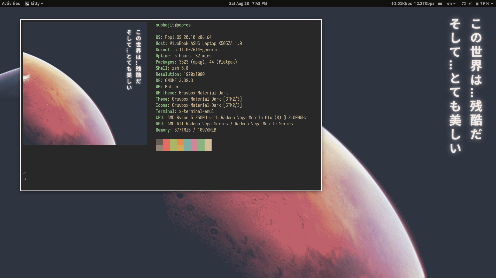
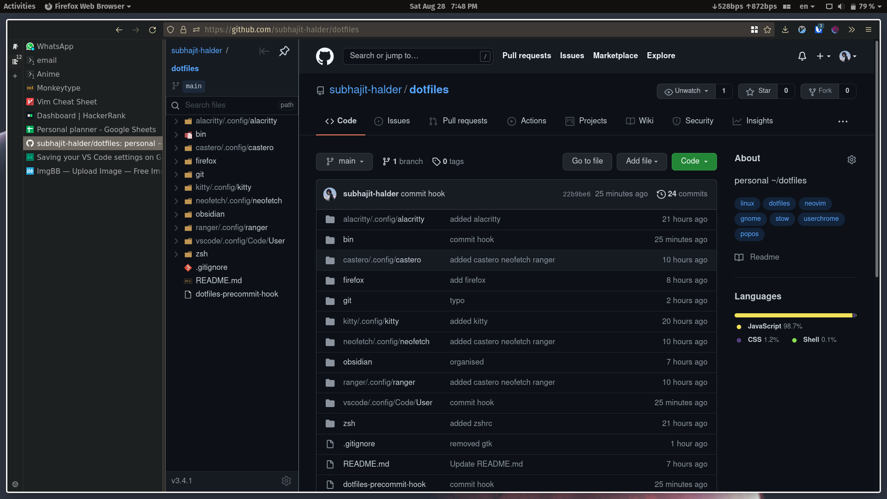
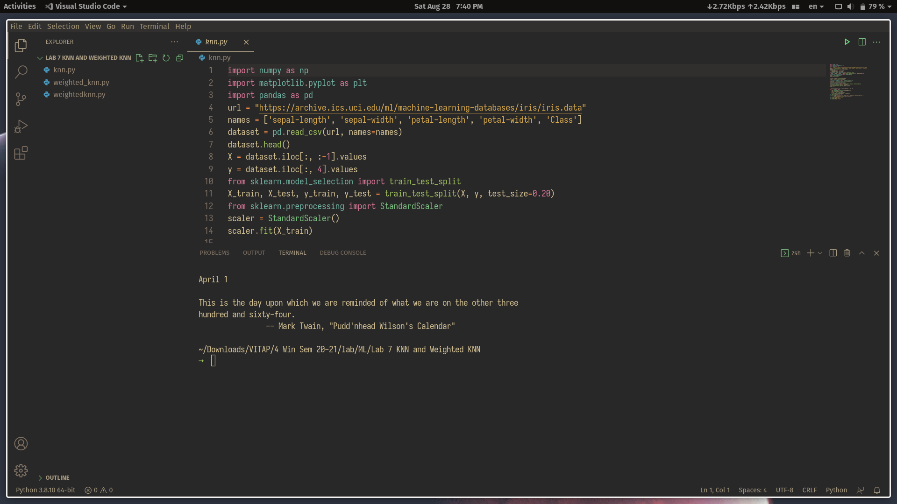

## Table of content

- [Table of content](#table-of-content)
- [Screenshots](#screenshots)
- [Application list](#application-list)
  - [Obsidian](#obsidian)
  - [gtk/icon theme](#gtkicon-theme)
  - [Firefox](#firefox)
  - [VScode](#vscode)

## Screenshots

|  |  |
|-------------------------------|--------------------------------------|
|   |           |

## Application list

- Development / notetaking
  - neovim
  - VScode
  - Jupyter notebook
  - RStudio
  - Android Studio
  - Obsidian
  - Marktext
- Tools
  - alacritty
  - kitty
  - gnome-tweaks
  - virtualbox
  - virt-manager
  - nautilus
  - bitwarden
- Browser
  - Firefox
  - Chrome
  - Chromium

### Obsidian

- put `.obsidian` in your obsidian vault root
- `.obsidian.vimrc` is config file for the obsidian vim mode  (plugin - <https://github.com/esm7/obsidian-vimrc-support>)

### gtk/icon theme

- <https://github.com/sainnhe/gruvbox-material-gtk>

### Firefox

 all of my other settings are done through the browser

- about:config
  - `browser.fullscreen.autohide : false`
  - `toolkit.legacyUserProfileCustomizations.stylesheets : true` and copy the userchrome file

#### firefox addons list

1. [Bitwarden](https://addons.mozilla.org/en-GB/firefox/addon/bitwarden-password-manager/) - password manager
2. [clearurls](https://addons.mozilla.org/en-GB/firefox/addon/clearurls/) - removes tracking elements from url
3. [cookie quick manager](https://addons.mozilla.org/en-GB/firefox/addon/cookie-quick-manager/)
4. [dark reader](https://addons.mozilla.org/en-GB/firefox/addon/darkreader/) - dark mode, changing website theme and fonts
5. [Disable WebRTC](https://addons.mozilla.org/en-GB/firefox/addon/happy-bonobo-disable-webrtc/) 
6. [Firefox multi-account containers](https://addons.mozilla.org/en-GB/firefox/addon/multi-account-containers/)
7. [gnome shell integration](https://addons.mozilla.org/en-GB/firefox/addon/gnome-shell-integration/)
8. [https everywhere](https://addons.mozilla.org/en-GB/firefox/addon/https-everywhere/)
9. [Mal-sync](https://addons.mozilla.org/en-GB/firefox/addon/mal-sync/) - syncs anime progress with anilist automatically
10. [octotree - github sidetree](https://addons.mozilla.org/en-GB/firefox/addon/octotree/)
11. [pocketube](https://addons.mozilla.org/en-GB/firefox/addon/youtube-subscription-groups/) - subscription categories on youtube 
12. [Reddit enhancement suite](https://addons.mozilla.org/en-GB/firefox/addon/reddit-enhancement-suite/)
13. [Sidebery](https://addons.mozilla.org/en-GB/firefox/addon/sidebery/) - tabs on left side
14. [tapermonkey](https://addons.mozilla.org/en-GB/firefox/addon/tampermonkey/) - userscript manager
15. [ublock origin](https://addons.mozilla.org/en-GB/firefox/addon/ublock-origin/) 
16. [vimium](https://addons.mozilla.org/en-GB/firefox/addon/vimium-ff/) 
17. [web archives](https://addons.mozilla.org/en-GB/firefox/addon/view-page-archive/)
18. [youtube channel whitelist for ublock origin](https://addons.mozilla.org/en-GB/firefox/addon/youtube-channel-whitelist/)
19. [Decentraleyes](https://addons.mozilla.org/en-GB/firefox/addon/decentraleyes/) 
20. [Firefox Relay](https://addons.mozilla.org/en-GB/firefox/addon/private-relay/)

### VScode

extension list stored in `vscode`  
